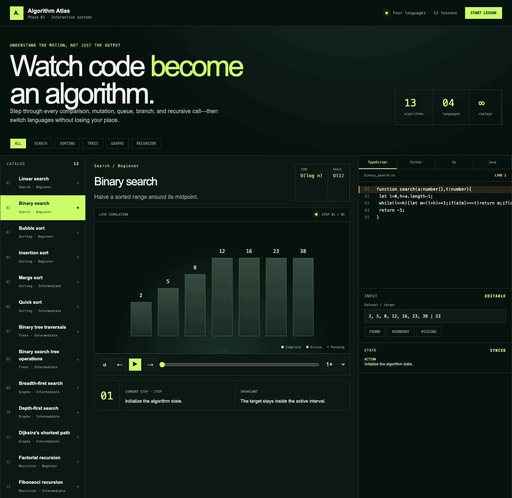

# Algorithm Atlas

Algorithm Atlas is an interactive learning lab that synchronizes algorithm
steps, highlighted source code, and Three.js visualizations.

Phase 1 includes implementations in TypeScript, Python, Go, and Java. Choose an
algorithm, language, input preset, and variant, then play or step through the
simulation.

**Live demo:** [rogelio171.github.io/AlgorithmAtlas](https://rogelio171.github.io/AlgorithmAtlas/)



## Phase 1 catalog

- Search: Linear Search, Binary Search
- Sorting: Bubble Sort, Insertion Sort, Merge Sort, Quick Sort
- Trees: Binary Tree Traversals, Binary Search Tree Operations
- Graphs: Breadth-First Search, Depth-First Search, Dijkstra's Shortest Path
- Recursion: Factorial, Fibonacci

## Features

- Three.js scenes for arrays, trees, graphs, and recursive call stacks
- Code highlighting synchronized with every simulation step
- TypeScript, Python, Go, and Java implementations
- Play, pause, previous, next, reset, and playback-speed controls
- Custom inputs, example presets, and algorithm-specific variants
- Responsive desktop and mobile layouts

## Run locally

Requires Node.js 22.13 or newer.

```bash
npm install
npm run dev
```

Open the local URL printed by the development server.

## GitHub Pages

Every push to `main` runs `.github/workflows/pages.yml`, creates a static Vite
build with the `/AlgorithmAtlas/` base path, and deploys the `out/` directory to
GitHub Pages. You can verify that export locally with:

```bash
npm run build:pages
```

## Verify

```bash
npm run lint
npm test
```

## Project structure

- `app/AlgorithmLab.tsx`: interactive lab and Three.js renderer
- `app/algorithmData.ts`: catalog and four-language code samples
- `app/globals.css`: responsive visual design
- `tests/rendered-html.test.mjs`: production-render smoke test

## Documentation

Full documentation lives in [`docs/`](docs/README.md):

- [Tech stack](docs/tech-stack.md) — every dependency and what it is actually used for
- [Architecture](docs/architecture.md) — layout, module graph, data flow, build targets
- [How it works](docs/how-it-works.md) — simulation engine, 3D renderer, code highlighting
- [Algorithm catalog](docs/algorithms.md) — inputs, presets, variants, complexity
- [Development](docs/development.md) — scripts, tests, linting, conventions
- [Deployment](docs/deployment.md) — GitHub Pages and the Cloudflare Worker path
- [Adding an algorithm](docs/adding-an-algorithm.md) — step-by-step recipe

## License

MIT
