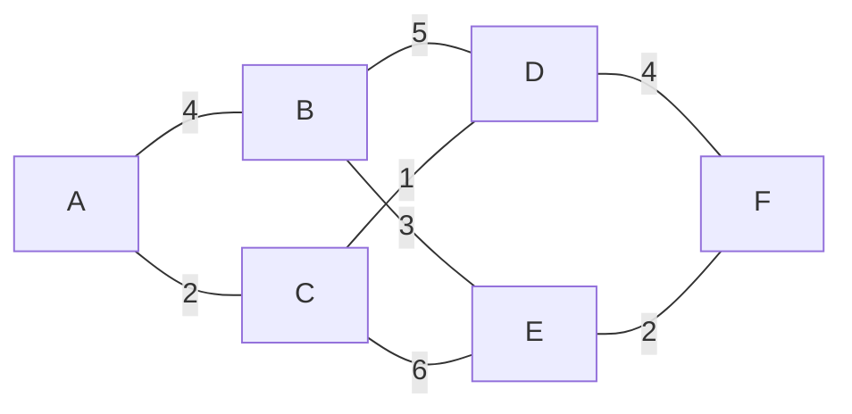

# Algorithm catalog

Thirteen algorithms across five categories, each available in TypeScript,
Python, Go, and Java. Definitions live in `app/algorithmData.ts`; the traces
that animate them live in `app/simulation.ts`.

## The `AlgorithmDefinition` shape

```ts
type AlgorithmDefinition = {
  id: string;            // stable key: dispatch, code lookup, filename display
  title: string;
  category: string;      // Search | Sorting | Trees | Graphs | Recursion
  difficulty: string;    // Beginner | Intermediate
  summary: string;       // one line under the lesson title
  insight: string;       // shown as INVARIANT in the live-state panel
  time: string;          // TIME badge
  space: string;         // SPACE badge
  structure: StructureKind; // array | graph | tree | recursion — drives stage layout
  defaultInput: string;
  presets: { label: string; value: string }[];
  variants?: string[];   // renders the variant button row when present
};
```

## Catalog

| # | Algorithm | Category | Difficulty | Time | Space | Structure | Variants |
| --- | --- | --- | --- | --- | --- | --- | --- |
| 1 | Linear search | Search | Beginner | O(n) | O(1) | array | — |
| 2 | Binary search | Search | Beginner | O(log n) | O(1) | array | — |
| 3 | Bubble sort | Sorting | Beginner | O(n²) | O(1) | array | — |
| 4 | Insertion sort | Sorting | Beginner | O(n²) | O(1) | array | — |
| 5 | Merge sort | Sorting | Intermediate | O(n log n) | O(n) | array | — |
| 6 | Quick sort | Sorting | Intermediate | O(n log n) avg | O(log n) | array | — |
| 7 | Binary tree traversals | Trees | Intermediate | O(n) | O(h) | tree | Inorder, Preorder, Postorder |
| 8 | Binary search tree operations | Trees | Intermediate | O(h) | O(h) | tree | Search, Insert, Delete |
| 9 | Breadth-first search | Graphs | Intermediate | O(V + E) | O(V) | graph | — |
| 10 | Depth-first search | Graphs | Intermediate | O(V + E) | O(V) | graph | — |
| 11 | Dijkstra's shortest path | Graphs | Intermediate | O((V + E) log V) | O(V) | graph | — |
| 12 | Factorial recursion | Recursion | Beginner | O(n) | O(n) | recursion | — |
| 13 | Fibonacci recursion | Recursion | Intermediate | O(2ⁿ) | O(n) | recursion | — |

The catalog is filtered by the tab row: `All`, `Search`, `Sorting`, `Trees`,
`Graphs`, `Recursion`.

## Input formats

The input box is one free-text field. Its meaning depends on the algorithm's
structure.

| Structure | Format | Example | Notes |
| --- | --- | --- | --- |
| array (search) | `values \| target` | `2, 5, 8, 12, 16, 23, 38 \| 23` | Binary search assumes the list is already sorted |
| array (sorting) | `values` | `7, 3, 9, 2, 6` | Anything after `\|` is ignored |
| tree | `level-order values \| key` | `8, 4, 12, 2, 6, 10, 14 \| 6` | Values fill an implicit heap array: children of slot `i` are `2i+1`, `2i+2` |
| graph | `start \| end` | `A \| F` | Only the first character of each side is read. The graph itself is fixed |
| recursion | `n` | `5` | Clamped to `1…7` |

Two limits are enforced by `parseInput`: at most **9 values**, and non-numeric
entries are silently dropped. Every algorithm has a built-in fallback dataset,
so a partially typed input still renders.

## Presets

Each algorithm ships three one-click presets that overwrite the input and rewind
to step 0 — typically a representative case, an edge case, and a
missing/duplicate case. Examples:

- Linear search: `Found`, `First`, `Missing`
- Bubble sort: `Mixed`, `Nearly sorted`, `Reverse`
- Merge sort: `Mixed`, `Odd length`, `Duplicates`
- BFS: `From A`, `From C`, `From F`
- Dijkstra: `A → F`, `B → E`, `C → F`
- Factorial: `n = 5`, `Base case`, `n = 7`

## The graph used by BFS / DFS / Dijkstra

Six nodes, eight undirected weighted edges:



Edge list (from `graphEdges` in `app/simulation.ts`): `A-B 4`, `A-C 2`,
`B-D 5`, `B-E 3`, `C-D 1`, `C-E 6`, `D-F 4`, `E-F 2`.

Node positions are hand-tuned constants in
`CubeStage.tsx › graphPositions`, so the layout is stable and readable rather
than force-directed.

## Known simplifications

These are deliberate scope choices, documented so they are not mistaken for bugs:

- **BST variants do not change the trace.** `Search`, `Insert`, and `Delete` all
  animate the same root-to-target comparison walk; only the caption text differs.
  Insert and delete rebalancing are not simulated.
- **Dijkstra ignores the target node.** `A | F` picks the start; the trace
  settles every reachable node rather than stopping at `F`.
- **Fibonacci is truncated.** The call expansion stops after 16 frames, so large
  `n` shows a representative slice of the recursion tree, not the whole thing.
- **Tree input is level-order into a perfect-shape array.** Feeding values that
  do not form a valid BST will render a tree, but the BST comparison walk will
  behave accordingly.
